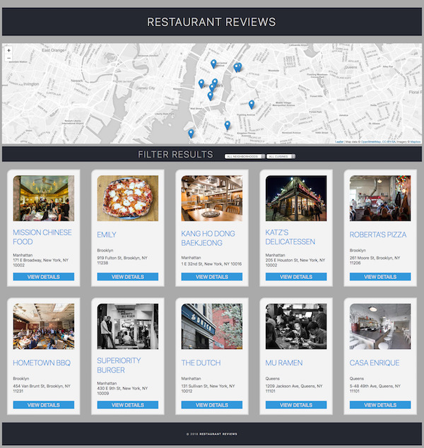

# README

<a href="https://www.udacity.com/">
  
</a>

[Udacity Google Mobile Web Specialist Nanodegree program](https://www.udacity.com/course/mobile-web-specialist-nanodegree--nd024)

[Project 1. Restaurant Reviews app](https://github.com/br3ndonland/udacity-google-mws)

Brendon Smith

[br3ndonland](https://github.com/br3ndonland)

[](https://choosealicense.com/)

[](https://github.com/standard/standard)

## Table of Contents <!-- omit in toc -->

- [Description](#description)
- [Repository contents](#repository-contents)
- [Projects](#projects)
  - [Project 1](#project-1)
  - [Project 2](#project-2)

## Description

This is a web application that displays a list of restaurants and associated information. I completed this project for my [Udacity Google Mobile Web Specialist Nanodegree program](https://www.udacity.com/course/mobile-web-specialist-nanodegree--nd024).



I was awarded a scholarship to this Nanodegree program after completing the [Udacity Grow with Google](https://www.udacity.com/grow-with-google) Scholarship challenge course, in the Intermediate Web Developer track. Materials from the challenge course are available in my [udacity-google repo](https://github.com/br3ndonland/udacity-google).


## Repository contents

- [info](info): Project documentation, reviews, and computational narratives.
- [lessons](lessons): Lesson notes, divided into subdirectories for each part of the Nanodegree program.
- [src](src): Application source files.
- [assets](assets)
  - [css](assets/css)
    - [styles.css](assets/css/styles.css): Styles used in application. Features CSS Grid, variables ("custom properties"), and BEM (Block Element Modifier).
  - [img](assets/img): Images used in application.
  - [js](assets/js)
    - [dbhelper.js](assets/js/dbhelper.js): JavaScript class constructor with static methods to serve data to the app.
      - [index.js](assets/js/index.js): JavaScript for application homepage.
      - [restaurant.js](assets/js/restaurant.js): JavaScript for restaurant details page.
- [data](data)
  - [restaurants.json](data/restaurants.json): Restaurant data in JSON format.
- [.gitignore](.gitignore): Instructions to Git to exclude certain files from commits.
- [index.html](index.html): Application homepage.
- [restaurant.html](restaurant.html): Restaurant details page.
- [sw.js](sw.js): Service Worker for offline caching.
- [README.md](README.md): This file, a concise description of the repository.

## Projects

### Project 1

Project 1 had three parts:

1. **Responsive design**
2. **Accessibility features**
3. **Offline capability**

Run a local HTTP server to test the application. There are multiple pages, so it is helpful to run a server instead of directly opening the HTML in a browser.

  ```sh
  cd <PATH>
  python3 -m http.server 8000
  ```

### Project 2

- In project 2, we use a Node server to deliver the data.