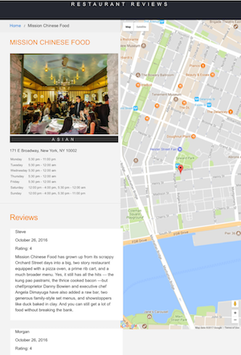
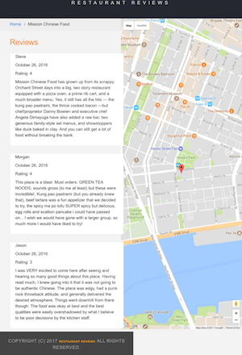
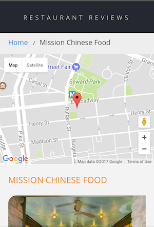

# Project docs

[Udacity Google Mobile Web Specialist Nanodegree program](https://www.udacity.com/course/mobile-web-specialist-nanodegree--nd024)

[Project 1. Restaurant Reviews app](https://github.com/br3ndonland/udacity-google-mws)

Brendon Smith

[br3ndonland](https://github.com/br3ndonland)

## Table of Contents <!-- omit in toc -->

- [Project overview](#project-overview)
  - [Introduction](#introduction)
  - [Specification](#specification)
  - [Requirements](#requirements)
- [Project instructions](#project-instructions)
  - [Getting started](#getting-started)
  - [Steps to complete the project](#steps-to-complete-the-project)
  - [Submission instructions](#submission-instructions)
- [Project rubric](#project-rubric)
  - [Responsive design](#responsive-design)
  - [Accessibility](#accessibility)
  - [Offline availability](#offline-availability)

## Project overview

### Introduction

> For the Restaurant Reviews projects, you will incrementally convert a static webpage to a mobile-ready web application. In Stage One, you will take a static design that lacks accessibility and convert the design to be responsive on different sized displays and accessible for screen reader use. You will also begin converting this to a Progressive Web Application by caching some assets for offline use.

### Specification

> You will be provided code for a restaurant reviews website. The code has a lot of issues. It’s barely usable on a desktop browser, much less a mobile device. It also doesn’t include any standard accessibility features, and it doesn’t work offline at all. Your job is to update the code to resolve these issues while still maintaining the included functionality.

### Requirements

- **Make the provided site fully responsive.** All of the page elements should be usable and visible in any viewport, including desktop, tablet, and mobile displays. Images shouldn't overlap, and page elements should wrap when the viewport is too small to display them side by side.
  - You will convert a site that looks like this:
    - 
    - 
  - into a site that looks like this:
    - 
- **Make the site accessible.** Using what you've learned about web accessibility, ensure that alt attributes are present and descriptive for images. Add screen-reader-only attributes when appropriate to add useful supplementary text. Use semantic markup where possible, and aria attributes when semantic markup is not feasible.
- **Cache the static site for offline use.** Using Cache API and a ServiceWorker, cache the data for the website so that any page (including images) that has been visited is accessible offline.

## Project instructions

### Getting started

- Fork and clone the [starter repository](https://github.com/udacity/mws-restaurant-stage-1). The code in this repository will serve as your baseline to begin development.
  - From inside the new directory, launch a local client server using Python from your terminal:
    Python 2: `python -m SimpleHTTPServer 8000`
    Python 3: `python3 -m http.server 8000`
  - Visit the site in your browser at `http://localhost:8000`
- You will need a MapBox API key. Replace the text `<your MAPBOX API KEY HERE>` inside of *main.js* with your key. MapBox API is free to use, without providing any payment information.
- If you would like to use Google Maps, there is a google-maps branch of the starter code. You'll need your own [Google Maps API key](https://developers.google.com/maps/documentation/javascript/get-api-key). Replace the text YOUR_GOOGLE_MAPS_API_KEY in index.html and restaurant.html with your own key.

### Steps to complete the project

1. Convert the provided site to use a **responsive** design
    - Bootstrap and other CSS frameworks should not be used; all responsiveness should be done with CSS.
    - Use appropriate document type declaration and viewport tags
    - Create a responsive grid-based layout using CSS
    - Use media queries that provide fluid breakpoints across different screen sizes
    - Use responsive images that adjust for the dimensions and resolution of any mobile device
2. Implement **accessibility** features in the site HTML (most of this HTML is generated by JavaScript functions).
3. Add a **ServiceWorker** script to cache requests to all of the site’s assets so that any page that has been visited by a user will be accessible when the user is offline. Only caching needs to be implemented, no other ServiceWorker features.

Consult the [rubric](https://review.udacity.com/#!/rubrics/1090/view) often to be sure you are meeting the specific project requirements.

### Submission instructions

1. Push your project to GitHub, making sure to push the master branch.
2. On the project submission page choose the option 'Submit with GitHub'
3. Select the repository for this project (you may need to connect your GitHub account first).

## Project rubric

### Responsive design

- [ ] Is the site UI compatible with a range of display sizes?
  - [ ] All content is responsive and displays on a range of display sizes.
  - [ ] Content should make use of available screen real estate and should display correctly at all screen sizes.
  - [ ] An image's associated title and text renders next to the image in all viewport sizes.
- [ ] Are images responsive?
  - [ ] Images in the site are sized appropriate to the viewport and do not crowd or overlap other elements in the browser, regardless of viewport size.
- [ ] Are application elements visible and usable in all viewports?
  - [ ] On the main page, restaurants and images are displayed in all viewports. The detail page includes a map, hours and reviews in all viewports.

### Accessibility

- [ ] Are images accessible?
  - [ ] All content-related images include appropriate alternate text that clearly describes the content of the image.
  - [ ] Is focus used appropriately to allow easy navigation of the site?
  - [ ] Focus is appropriately managed allowing users to noticeably tab through each of the important elements of the page. Modal or interstitial windows appropriately lock focus.
- [ ] Are site elements defined semantically?
  - [ ] Elements on the page use the appropriate semantic elements. For those elements in which a semantic element is not available, appropriate `ARIA roles` are defined.

### Offline availability

- [ ] Are pages that have been visited available offline?
  - [ ] When available in the browser, the site uses a service worker to cache responses to requests for site assets. Visited pages are rendered when there is no network access.

[(Back to top)](#top)
