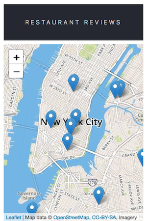
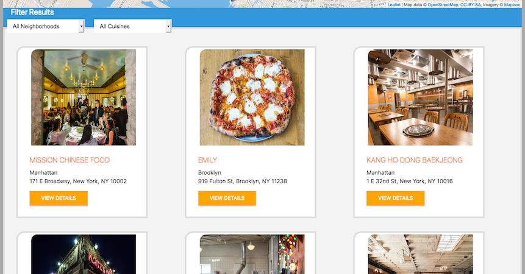
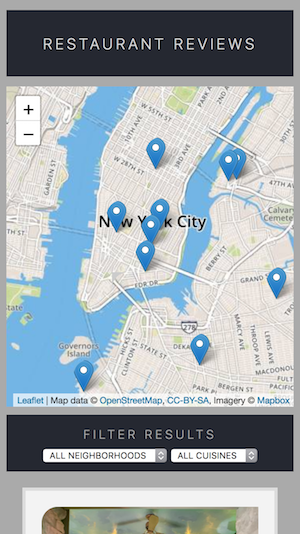

# Computational narrative

<a href="https://www.udacity.com/">
  
</a>

[Udacity Google Mobile Web Specialist Nanodegree program](https://www.udacity.com/course/mobile-web-specialist-nanodegree--nd024)

[Project 1. Restaurant Reviews app](https://github.com/br3ndonland/udacity-google-mws)

Brendon Smith

[br3ndonland](https://github.com/br3ndonland)

## Table of Contents <!-- omit in toc -->

- [Getting started](#getting-started)
  - [Map](#map)
- [Responsive design](#responsive-design)
  - [Simple structure and styling](#simple-structure-and-styling)
  - [CSS Grid restaurant list](#css-grid-restaurant-list)
  - [Restaurant details page](#restaurant-details-page)
- [Accessibility](#accessibility)
- [Offline availability](#offline-availability)
  - [dbhelper](#dbhelper)
  - [Service Worker](#service-worker)
- [Review](#review)

## Getting started

- Forked and cloned the repo
- Created a `dev` branch
- Started a local HTTP server in the directory

  ```sh
  cd computing/udacity-google-mws
  python3 -m http.server 8000
  ```

### Map

- Signed up for [Mapbox](https://www.mapbox.com).
- [Leaflet](https://leafletjs.com/).

## Responsive design

### Simple structure and styling

- I worked on one page at a time.
- I started by cleaning up the HTML structure.
- I organized the CSS and worked on some simple styling changes.
  - I added `border-top-left-radius: 1rem;` to `img` to achieve the rounded corner as shown in the mockup.
  - I modified some of the colors and text effects to match the header to the mockup, and style the header and footer consistently.
  - Here's how it's looking now:

    

- Git commit at this point: Style homepage header and footer 83fe5d7

### CSS Grid restaurant list

- I opted to use CSS Grid for layout and responsive design.
- I started with the [Wes Bos CSS grid course](https://cssgrid.io/).
- I also reviewed the [MDN CSS Layout Guide](https://developer.mozilla.org/en-US/docs/Learn/CSS/CSS_layout).
- I changed the restaurant list from an unordered list to a container div, then styled the container into a grid.
- I changed this line in *index.html*:

  ```html
  <ul id="restaurant-list"></ul>
  ```

- To this:

  ```html
  <div class="container" id="restaurant-list"></div>
  ```

- And then styled the container with CSS, including a [CSS variable](https://developer.mozilla.org/en-US/docs/Web/CSS/--*) ("custom property"):

  ```css
  .container {
    display: grid;
    grid-template-columns: 1fr 1fr 1fr;
    grid-gap: 0.2rem;
    border: var(--border);
  }
  ```

- This results in a nice grid for the restaurants:

  

- Git commit: Add CSS Grid for homepage restaurants bd154fd
- Next, I made the restaurant grid responsive.
  - Use `auto-fill` and `minmax()` for responsive reflowing
  - Trim unneccessary CSS
  - Organize CSS, img, and JS in /assets
  - I considered formatting the entire page as a grid, with the restaurant list as a nested grid. I decided I didn't need to at this time, because the page is looking responsive.

  

- Git commit: Responsively reflow restaurant grid

### Restaurant details page

- After completing the homepage, I worked on the restaurant details page.
- I deleted most of the provided CSS.
- I organized the CSS with [BEM](https://css-tricks.com/bem-101/).
- I switched to the light map style with `id: mapbox.light`. I was also able to use moonlight with the direct URL to the style in my account, but stuck with light.
- I used nested grids to organize the page:
  - Info: I created a grid to display the restaurant info and image inline. I used `justify-items: end;` to spread each part of the grid out to the sides.
  - Reviews: I changed the review body to blockquote, and styled with italic.
- Responsive grids: It was difficult to get the info and reviews grids to reflow responsively. It wasn't as simple as using `auto-fill` and `minmax()` like I did on the homepage. Instead, I set the columns to `1fr` by default, and wrote a media query to scale on larger displays. I based the breakpoint on the [Bootstrap medium responsive breakpoint](https://getbootstrap.com/docs/4.1/layout/overview/#responsive-breakpoints).
- Screenshot of responsive restaurant details page (full page screenshots captured in Firefox Developer Edition, and assembled in [Figma](https://www.figma.com/))

  

- The homepage is also looking great now.

  

- I modified the JavaScript files to create divs instead of uls, and to add class names and alt text.

## Accessibility

- Alt text: I added alt text with JavaScript
- Focus:
  - I went through the Udacity focus lessons.
  - I had to turn on "Full Keyboard Access" (macOS System Preferences -> Keyboard -> Shortcuts -> Full Keyboard Access -> Select "All controls").
  - The DOM is well-organized, so it isn't necessary to set `taborder`.
  - I added an event listener to *main.js* so map markers can be clicked with the enter key. As I have learned [before](https://github.com/br3ndonland/udacity-fsnd-p5-map/blob/master/info/map-methods.md#filter-markers-based-on-dropdown-selection), handling DOM events is more difficult than it should be. Leaflet has a 'keypress' event listed in the docs, but I need enter specifically, not just any keypress. Their documentation is not very useful, and the sidenav is sitting obnoxiously on top of the page content.
  - I tried this but it didn't work:

    ```js
    marker.onkeyup = function (e) {
      if (e.keyCode === 13) {
        alert('Pressed enter')
      }
    }
    ```

  - I just gave up at this point. It shouldn't be so difficult to implement accessibility features.

## Offline availability

### dbhelper

- *dbhelper.js* vs *sw.js*: At first, I thought *dbhelper.js* was the Service Worker. I was going to revise *dbhelper.js*, move it to the root directory, name it *sw.js*, and use it as the Service Worker. I later realized that *dbhelper.js* is a separate set of utility methods for the app. It uses a [class constructor](https://github.com/br3ndonland/udacity-google/blob/master/es6/es6-2-functions.md) with [static methods](https://developer.mozilla.org/en-US/docs/Web/JavaScript/Reference/Classes/static).
- I didn't need to modify *dbhelper.js* much. I cleaned up some of the comments.
- I tried rewriting the XHR code with Fetch and Async/Await. I couldn't get it working, and it's not critical for the performance of the app, so I left it as XHR. For reference, I included my code below.
- <details><summary>Static method to fetch restaurants in <em>dbhelper.js</em> rewritten with Fetch and Async/Await</summary>

  ```js
  // Fetch
  static fetchRestaurants (callback) {
    fetch(DBHelper.DATABASE_URL)
      .then(function (response) {
        return response.json()
      })
      .then(function (json) {
        callback(null, json)
      })
      .catch(error => {
        const errorResponse = (`Request failed with error ${error}`)
        callback(errorResponse, null)
      })
  }

  // Fetch with async/await
  static async fetchRestaurants () {
    try {
      const query = fetch(DBHelper.DATABASE_URL)
      const data = await (await query).json()
      const restaurants = data.restaurants
    } catch (e) {
      throw Error(e)
    }
  }

  ```

  </details>

### Service Worker

#### Service Worker resources

- [Udacity MWS Doug Brown webinar 0.39.19](https://youtu.be/92dtrNU1GQc?t=39m19s)
- [Josh Ethridge's project](https://github.com/jethridge13/mws-restaurant)
- [MDN Service Worker page](https://developer.mozilla.org/en-US/Apps/Progressive/Offline_Service_workers)
- [Google PWA page](https://developers.google.com/web/progressive-web-apps/)
- [Google Service Worker primer](https://developers.google.com/web/fundamentals/primers/service-workers/)
- I reviewed my [notes](https://github.com/br3ndonland/udacity-google/blob/master/offline-web-apps/offline-2-sw.md) from the Service Worker lesson. They weren't very helpful.
- Debugging
  - Firefox: *about:debugging#workers*
  - Chrome: *chrome://inspect/#service-workers*

#### Create service worker

- **Service worker is a JavaScript file that sits between the browser and network requests.** It's like a local web server that serves content from a cache.
- The Service Worker formatting is fairly standard. I followed Doug Brown and Josh Ethridge's work.
- It's important to have *sw.js* in the top-level directory, so it can cache anything in the directory.

#### Register service worker

- The service worker needs to be registered by the JavaScript code for each page. I used the Doug Brown option below.

  ```js
  // Register service worker - simple version
  if ('serviceworker' in navigator) {
    navigator.serviceWorker.register('/sw.js')
  }
  // Register service worker - version adapted from Doug Brown webinar
  if ('serviceworker' in navigator) {
    navigator.serviceWorker.register('/sw.js').then(reg => {
      console.log(`Service worker registration successful for ${reg.scope}`)
    }).catch(e => {
      console.log(`Registration failed with error ${e}`)
    })
  }
  ```

- I didn't see the Service Worker showing up in my browser.
  - I tried both Chrome and Firefox. No *sw.js* on the Network or Service Workers pages.
  - I tried registering it on the dbhelper.js page as well. No result.
  - After scrutinizing the code and comparing it with the examples listed [above](#service-worker-resources), I realized that **I just needed a simple change from `serviceworker` to `serviceWorker` in the registration step:**

    ```js
    if ('serviceWorker' in navigator) {
      console.log(`Registering Service Worker.`)
      navigator.serviceWorker.register('/sw.js').then(reg => {
        console.log(`Service Worker registration successful for ${reg.scope}`)
      }).catch(e => {
        console.log(`Registration failed with error ${e}`)
      })
    }
    ```

  - **JavaScript is case-sensitive!**
  - After making this change, the Service Worker was successfully registered. I can see the registration message in the console, and the service worker appears on the Service Workers page (about:debugging#workers in Firefox).

#### Test Service Worker

- Now that the Service Worker is registered, I need to test functionality in poor network conditions.
- Offline testing was easiest in Chrome. On the application tab in dev tools, I clicked "Service Workers" and then checked "Offline." I was able to successfully cache the static assets.
- Everything showed up offline except map tiles. If I hadn't navigated to every restaurant page before going offline, and then navigated directly to a restaurant page while offline, like [http://localhost:8000/restaurant.html?id=8](http://localhost:8000/restaurant.html?id=8), I wouldn't have the map tile. I therefore need to cache all the map tiles on first page load.
- To cache map tiles for every restaurant, I added the specific restaurant page IDs to the `filesToCache` array, like `'/restaurant.html?id=1'`. When I navigated to the homepage, went offline, and then navigated to a specific restaurant page, I still got the map tiles. DONE!

## Review

See [p1-review.md](p1-review.md).

[(Back to top)](#top)
