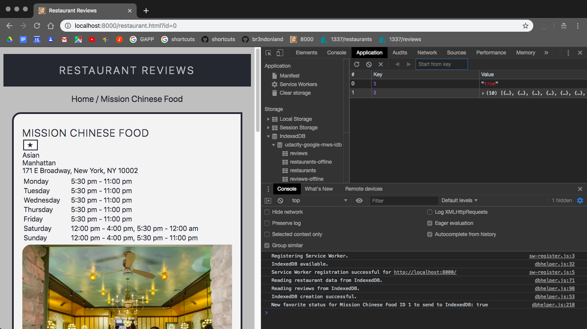
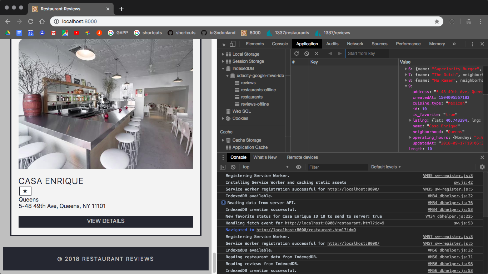
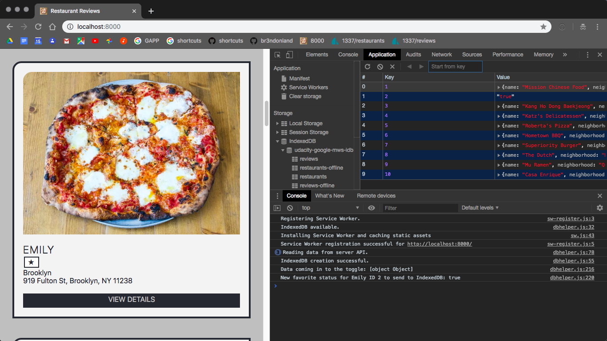
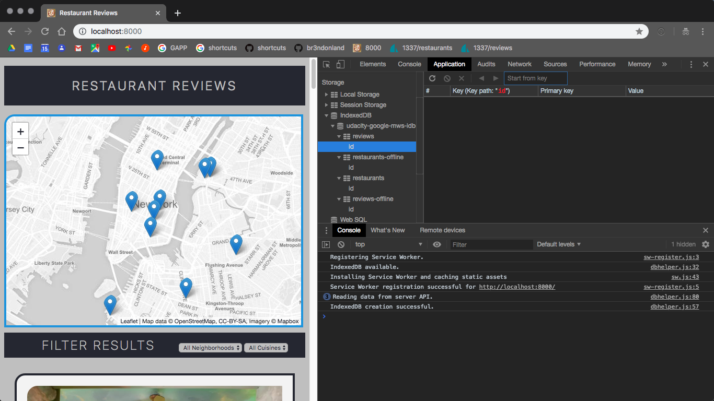
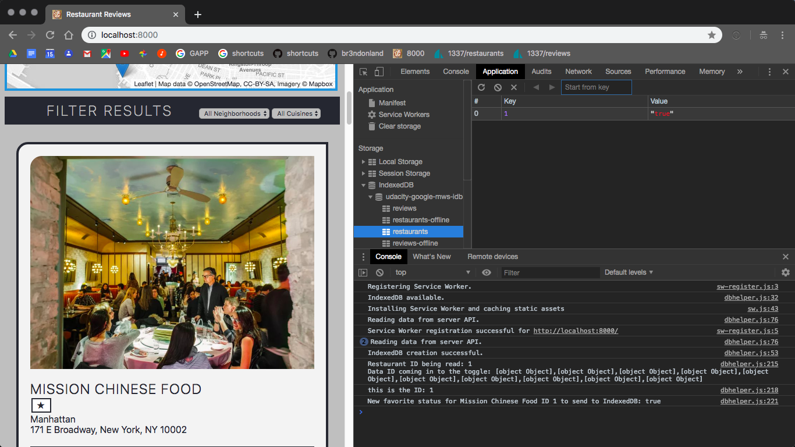

# Computational narrative

<a href="https://www.udacity.com/">
  
</a>

[Udacity Google Mobile Web Specialist Nanodegree program](https://www.udacity.com/course/mobile-web-specialist-nanodegree--nd024)

[Project 3. Restaurant Reviews app](https://github.com/br3ndonland/udacity-google-mws)

Brendon Smith

[br3ndonland](https://github.com/br3ndonland)

## Table of Contents <!-- omit in toc -->

- [Getting started](#getting-started)
- [Favorites](#favorites)
  - [Favorite button](#favorite-button)
  - [Favorite toggle](#favorite-toggle)
- [Reviews](#reviews)
  - [Fetch reviews from updated server API](#fetch-reviews-from-updated-server-api)
  - [Fetch reviews from IndexedDB](#fetch-reviews-from-indexeddb)
  - [User interface for adding reviews](#user-interface-for-adding-reviews)
  - [POST reviews](#post-reviews)
- [Syncing offline and online data](#syncing-offline-and-online-data)
  - [Check for network connection](#check-for-network-connection)
  - [Sync favorites](#sync-favorites)
  - [Sync reviews](#sync-reviews)
- [Other changes](#other-changes)
  - [Caching map tiles](#caching-map-tiles)
- [Performance](#performance)
- [Reflections](#reflections)

## Getting started

- Same strategy for the data server as in project 2, but it comes from a new repo.
- Cloned the [project 3 server repo](https://github.com/udacity/mws-restaurant-stage-3) into a separate directory.
- I watched the [Doug Brown project 3 walkthrough](https://www.youtube.com/watch?v=a7i0U1aCBok). Note Doug's use of [ternary conditional operators](https://en.wikipedia.org/wiki/%3F:) `?:`.

## Favorites

### Favorite button

- I created a favorite button with *index.js* in the `createRestaurantHTML()` function.
  - I used the HTML unicode character [white star `&#9734;`](https://unicode-table.com/en/2606/).
  - I included an if/then statement, in *dbhelper.js*, *index.js*, and *restaurant.js*, to change to the [black star `&#9733`](https://unicode-table.com/en/2605/) when the restaurant is favorited.

### Favorite toggle

#### Online

- Now that I have a favorite button, I need to use it to change the `is_favorite` value in the restaurant data. The project 3 data server provides a `PUT` endpoint at `http://localhost:1337/restaurants/<restaurant_id>/?is_favorite=true`.
- I started by creating a `toggleFavorite()` function in *dbhelper.js*, and getting it working over the network.
  - I set up a `fetch` query using the data server `PUT` endpoint. The `PUT` method updates the JSON data on the server. I used the [ternary conditional operators](https://en.wikipedia.org/wiki/%3F:) `?:`, as shown in the [Doug Brown project 3 walkthrough](https://www.youtube.com/watch?v=a7i0U1aCBok). The `?:` works like if/then, so if the restaurant JSON has `"is_favorite": "true",` the query will change it to `"is_favorite": "false",`.
  - Boolean vs. string: `true` and `false` can either be interpreted as Boolean (without quotes) or string (with quotes). See the [Doug Brown project 3 walkthrough](https://www.youtube.com/watch?v=a7i0U1aCBok) 0.15.00. I kept them as strings.
  - I included the same if/then statement from *index.js* and *restaurant.js* to change to the [black star `&#9733`](https://unicode-table.com/en/2605/) when the restaurant is favorited. I need it in all three files because I need to create the star when the page is rendered, and also change the star when the favorite status changes.
  - Here's how the online-only function looked initially:

    ```js
    static async toggleFavorite (restaurant) {
      try {
        const query = fetch(`${DBHelper.DATABASE_URL}/${restaurant.id}/?${restaurant.is_favorite === 'true' ? 'is_favorite=false' : 'is_favorite=true'}`, {method: 'PUT'})
        const response = await (await query).json()
        restaurant.is_favorite = response.is_favorite
        const favoriteButton = document.getElementById(`restaurant-${restaurant.id}`)
        console.log(`This is restaurant ID ${restaurant.id}`)
        if (restaurant.is_favorite === 'true') {
          favoriteButton.innerHTML = '&#9733'
          favoriteButton.setAttribute('aria-label', `Remove ${restaurant.name} from favorites`)
        } else {
          favoriteButton.innerHTML = '&#9734'
          favoriteButton.setAttribute('aria-label', `Add ${restaurant.name} to favorites`)
        }
        console.log(`Favorite status for ${restaurant.name}: ${restaurant.is_favorite}`)
      } catch (e) {
        throw Error(e)
      }
    }
    ```

#### Offline

##### IndexedDB confusion

<details><summary>Details of my struggles with IndexedDB</summary>

- After adding a click listener on the favorite icon, I worked on the `DBHelper.toggleFavorite(restaurant)` function. This was the challenging part.
  - I started by grabbing the appropriate element with `document.getElementById(`restaurant-${restaurant.id}`)`.
  - Next, I had to read the info from IDB. I was having two issues, shown in the image below:
    
      1. *Overwriting the JSON array in IndexedDB:* At first, I was reading the database with `store.getAll()`. The problem with this was that submitting a change in favorite status (like "true" or "false") was just overwriting the entire JSON object store. Rather than calling `store.getAll()`, I had to call `store.openCursor(0[restaurant.id])` to iterate through the JSON and read the object for this specific restaurant. There's just one JSON array for all the restaurants, so I use `0`, and I want to change the favorite status for this specific restaurant, so I use `restaurant.id` to find its object in the JSON array. Also note my use of Async/Await to read the data returned from IndexedDB.
      2. *Duplicating the JSON array in IndexedDB:* The second problem you can see in the image above is that I was duplicating the JSON array every time I loaded the page.
          1. I had to change the object store key path in `DBHelper.createDatabase()` from `{autoincrement: true}` to `{keyPath: 'id'}`. Also see [MDN IndexedDB keyPath vs. autoincrement](https://developer.mozilla.org/en-US/docs/Web/API/IndexedDB_API/Using_IndexedDB#Structuring_the_database).
          2. This was throwing some errors at first. Each time I open the object store, I have to reference the specific key path. I only have one JSON array, and keys start at 1. Each time I act on the object store, I need to add the `keyPath`, like `await restaurantsStore.put(restaurants, 1)`.
  - I also included an `else {}` condition to attempt to send changes directly to server API if IndexedDB is not present, basically functioning like a normal online web app in that case.
- Here's the `DBHelper.toggleFavorite(restaurant)` function at this point for reference:

  ```js
  // Static method to toggle favorite status of a restaurant by clicking the star button
  static async toggleFavorite (restaurant) {
    try {
      const favoriteButton = document.getElementById(`restaurant-${restaurant.id}`)
      // Look for IndexedDB and open JSON object with cursor
      const db = await idb.open('udacity-google-mws-idb', 1)
      const tx = db.transaction('restaurants', 'readwrite')
      const store = tx.objectStore('restaurants')
      const data = await store.openCursor(0[restaurant.id])
      if (data.length > 0) {
        // If IndexedDB is present, send data there
        restaurant.is_favorite = data.is_favorite === 'true' ? 'false' : 'true'
        console.log(`New favorite status for ${restaurant.name} ID ${restaurant.id} to send to IndexedDB: ${restaurant.is_favorite}`)
        await store.put(restaurant.is_favorite, 1)
        // TODO: POST to IDB restaurants-offline object store
      } else {
        // If IndexedDB is not present, attempt to send changes directly to server API
        const query = fetch(`${DBHelper.DATABASE_URL}/${restaurant.id}/?${restaurant.is_favorite === 'true' ? 'is_favorite=false' : 'is_favorite=true'}`, {method: 'PUT'})
        const response = await (await query).json()
        restaurant.is_favorite = response.is_favorite
        console.log(`New favorite status for ${restaurant.name} ID ${restaurant.id} to send to server: ${restaurant.is_favorite}`)
      }
      // Change icon
      if (restaurant.is_favorite === 'true') {
        favoriteButton.innerHTML = '&#9733'
        favoriteButton.setAttribute('aria-label', `Remove ${restaurant.name} from favorites`)
      } else {
        favoriteButton.innerHTML = '&#9734'
        favoriteButton.setAttribute('aria-label', `Add ${restaurant.name} to favorites`)
      }
    } catch (e) {
      throw Error(e)
    }
  }
  ```

- At this point, I thought IndexedDB was updating properly:
  
- There were some bugs lurking though.
  - *It didn't work offline.* I was testing this online when I thought it worked.
    - I found that `data.length > 0` would only work with `store.getAll()`. Using `store.get()` or `store.openCursor()` would actually not return `> 0`. As a result, the `DBHelper.toggleFavorite()` function would go to the `else` condition in the function, changing the value *on the server* instead of in IndexedDB.
    - I noticed that it would take a refresh to see the updated value. This was because IndexedDB was being overwritten with the new value from the JSON server. Thus, instead of going to IndexedDB like I thought, it was going to the server, which was then updating IndexedDB after a refresh or navigation to a new page. Changing `data.length > 0` to just `data` works though.
    - The need for a page refresh may be a Service Worker issue also. I'm not sure if I need to solve this to complete the project. My fellow scholar Josh Ethridge passed the project, and you can see this issue in his [`DBHelper.createFavoriteButton(restaurant)` function](https://github.com/jethridge13/mws-restaurant/blob/master/js/dbhelper.js).
  - *I was still overwriting the entire JSON array in IndexedDB.* When I corrected the function to actually change IndexedDB, I still had the same problem as before. It's just overwriting the entire array instead of finding the specific value it needs to update.
    - If I break up the JSON array by restaurant, as shown below, I still have the same problem. I do create individual database keys for each JSON object in the array, but when updating one, I just overwrite the entire thing.

      ```js
      // dbhelper.js
      // createDatabase() function
      // Store restaurant JSON in IndexedDB
      const restaurantsQuery = fetch(DBHelper.DATABASE_URL)
      const restaurants = await (await restaurantsQuery).json()
      restaurants.forEach(async restaurant => {
        const restaurantsTx = db.transaction('restaurants', 'readwrite')
        const restaurantsStore = restaurantsTx.objectStore('restaurants')
        await restaurantsStore.put(restaurant, restaurant.id)
      })
      ```

      
- On the [MDN IndexedDB keyPath vs. autoincrement](https://developer.mozilla.org/en-US/docs/Web/API/IndexedDB_API/Using_IndexedDB#Structuring_the_database) page, they also mention that you can create an index.
  - I tried creating an index, but it didn't seem to be the answer I needed. I wrote some code like this:

    ```js
    // Create IndexedDB
    const db = await idb.open('udacity-google-mws-idb', 1, upgradeDb => {
      const restaurants = upgradeDb.createObjectStore('restaurants', {keypath: 'id'})
      restaurants.createIndex('id', 'id', {unique: true})
      let index = restaurants.index('id')
      index.get('1').onsuccess = event => alert(`this is the index: ${event.target.result.id}`)
      const restaurantsOffline = upgradeDb.createObjectStore('restaurants-offline', {keypath: 'id'})
      restaurantsOffline.createIndex('id', 'id', {unique: true})
      const reviews = upgradeDb.createObjectStore('reviews', {keypath: 'id'})
      reviews.createIndex('id', 'id', {unique: true})
      const reviewsOffline = upgradeDb.createObjectStore('reviews-offline', {keypath: 'id'})
      reviewsOffline.createIndex('id', 'id', {unique: true})
      // upgradeDb.createObjectStore('pending', {autoIncrement: true})
    })
    ...
    ```

  - It basically just added sub-tables to the database.
    
- After my index fail, I went back to where I was before, overwriting the JSON array each time.
    
- I sometimes get this error:

  ```text
  dbhelper.js:237 Uncaught (in promise) Error: DataError: Failed to execute 'put' on 'IDBObjectStore': The object store uses out-of-line keys and has no key generator and the key parameter was not provided.
    at Function.toggleFavorite
  ```

- Talk about an opaque error message.
- I still think the answer lies in a cursor. I should open a cursor, then call `cursor.update()`.
- I worked with a cursor for a while. I opened a cursor at the object for the appropriate restaurant, using the `restaurant.id`, but I was still overwriting the entire object store.

  ```js
  // dbhelper.js
  // Opening a cursor at the restaurant ID
  static async toggleFavorite (restaurant) {
    try {
      const favoriteButton = document.getElementById(`restaurant-${restaurant.id}`)
      if ('indexedDB' in window) {
        console.log(`Restaurant ${restaurant.name} ID ${restaurant.id} selected.`)
        const db = await idb.open('udacity-google-mws-idb', 1)
        const tx = db.transaction('restaurants', 'readwrite')
        const store = tx.objectStore('restaurants')
        const data = await store.openCursor(restaurant.id)
        console.log(`Store gotten is for the restaurant ${data.value.name}.`)
        const newStatus = data.value.is_favorite === 'true' ? 'false' : 'true'
        await data.update(newStatus, 'is_favorite')
        restaurant.is_favorite = newStatus
        console.log(`New favorite status for ${restaurant.name} ID ${restaurant.id} to send to IndexedDB: ${newStatus}`)
      } else {
        // If IndexedDB is not present, attempt to POST changes directly to server API
        const query = fetch(`${DBHelper.DATABASE_URL}/${restaurant.id}/?${restaurant.is_favorite === 'true' ? 'is_favorite=false' : 'is_favorite=true'}`, {method: 'PUT'})
        // Fetch data from server with new favorite status
        const response = await (await query).json()
        restaurant.is_favorite = response.is_favorite
        console.log(`New favorite status for ${restaurant.name} ID ${restaurant.id} on server: ${restaurant.is_favorite}`)
      }
      // Change icon
      if (restaurant.is_favorite === 'true') {
        favoriteButton.innerHTML = '&#9733'
        favoriteButton.setAttribute('aria-label', `Remove ${restaurant.name} from favorites`)
      } else {
        favoriteButton.innerHTML = '&#9734'
        favoriteButton.setAttribute('aria-label', `Add ${restaurant.name} to favorites`)
      }
    } catch (e) {
      throw Error(e)
    }
  }

  ```

- This was equivalent to

  ```js
  static async toggleFavorite (restaurant) {
    try {
      const favoriteButton = document.getElementById(`restaurant-${restaurant.id}`)
      if ('indexedDB' in window) {
        console.log(`Restaurant ${restaurant.name} ID ${restaurant.id} selected.`)
        const db = await idb.open('udacity-google-mws-idb', 1)
        const tx = db.transaction('restaurants', 'readwrite')
        const store = tx.objectStore('restaurants')
        const data = await store.getAll()
        console.log(`Store gotten is for the restaurant ${data.name}.`)
        const newStatus = data.is_favorite === 'true' ? 'false' : 'true'
        await store.put(newStatus, restaurant.id)
        restaurant.is_favorite = newStatus
        console.log(`New favorite status for ${restaurant.name} ID ${restaurant.id} to send to IndexedDB: ${newStatus}`)
      } else {
        // If IndexedDB is not present, attempt to POST changes directly to server API
        const query = fetch(`${DBHelper.DATABASE_URL}/${restaurant.id}/?${restaurant.is_favorite === 'true' ? 'is_favorite=false' : 'is_favorite=true'}`, {method: 'PUT'})
        // Fetch data from server with new favorite status
        const response = await (await query).json()
        restaurant.is_favorite = response.is_favorite
        console.log(`New favorite status for ${restaurant.name} ID ${restaurant.id} on server: ${restaurant.is_favorite}`)
      }
      // Change icon
      if (restaurant.is_favorite === 'true') {
        favoriteButton.innerHTML = '&#9733'
        favoriteButton.setAttribute('aria-label', `Remove ${restaurant.name} from favorites`)
      } else {
        favoriteButton.innerHTML = '&#9734'
        favoriteButton.setAttribute('aria-label', `Add ${restaurant.name} to favorites`)
      }
    } catch (e) {
      throw Error(e)
    }
  }

  ```

</details>

##### IndexedDB confusion resolution

- **Database architecture:** I had to spend some time reading about IndexedDB and re-thinking my data model.
  - I created an **object store** for the restaurant data, and another for the reviews.
  - The data at `http://localhost:1337/restaurants` is an array of JSON objects. It is possible to store the entire JSON array as one entry in the database object store `restaurants`, but in order to make database operations easier, I split the JSON array up with one database entry per restaurant JSON object. This is an array, so I am able to use `items.forEach(item =>{})` to iterate over the array and store each JSON object as a database entry.
  - Here's the updated `DBHelper.createDatabase()` static method:

    ```js
    // dbhelper.js
    static async createDatabase () {
      try {
        if ('indexedDB' in window) {
          // Create IndexedDB
          const db = await idb.open('udacity-google-mws-idb', 1, upgradeDb => {
            upgradeDb.createObjectStore('restaurants', {keypath: 'id'})
            upgradeDb.createObjectStore('reviews', {keypath: 'id'})
          })
          // Store restaurant JSON in IndexedDB
          const restaurantsQuery = fetch(DBHelper.DATABASE_URL)
          const restaurants = await (await restaurantsQuery).json()
          restaurants.forEach(async restaurant => {
            const tx = db.transaction('restaurants', 'readwrite')
            const store = tx.objectStore('restaurants')
            await store.put(restaurant, restaurant.id)
          })
          // Store reviews JSON in IndexedDB
          const reviewsQuery = fetch(DBHelper.DATABASE_URL_REVIEWS)
          const reviews = await (await reviewsQuery).json()
          reviews.forEach(async review => {
            const tx = db.transaction('reviews', 'readwrite')
            const store = tx.objectStore('reviews')
            await store.put(review, review.id)
          })
        } else {
          console.warn('IndexedDB not available.')
        }
      } catch (e) {
        throw Error(e)
      }
    }
    ```

- **Database transactions:** Now that the database and object stores have been created, a **cursor** is needed in order to iterate over the object store and identify a specific entry.
  - The [MDN IDBCursor example page](https://developer.mozilla.org/en-US/docs/Web/API/IDBCursor#Example) and [source code on GitHub](https://github.com/mdn/indexeddb-examples/blob/master/idbcursor/scripts/main.js) are helpful. They feature a list of albums from my favorite rock band, Rush. Note the use of an **index** in the MDN example. An **index** ([Google](https://developers.google.com/web/ilt/pwa/working-with-indexeddb#working_with_ranges_and_indexes) | [MDN](https://developer.mozilla.org/en-US/docs/Web/API/IDBIndex)) is a way to reference a database entry by a property other than the primary key. Although the MDN example creates an index, it is not used in the `updateResult()` function, so I decided not to create an index at this point.
  - I was able to open a cursor for a specific restaurant with

    ```js
    const db = await idb.open('udacity-google-mws-idb', 1)
    const tx = db.transaction('restaurants', 'readwrite')
    const store = tx.objectStore('restaurants')
    const cursor = await store.openCursor(restaurant.id)
    ```

  - Cursors store data in `cursor.value`.
  - Next, I need to update `cursor.value.is_favorite`.
    - This step was difficult for me. I kept overwriting the entire database entry (the entire JSON object for the restaurant), instead of just changing the `is_favorite` attribute.
    - After several days of frustration, I realized that the syntax I was using was causing the problem. I was toggling favorite status with the [ternary conditional operator syntax](https://en.wikipedia.org/wiki/%3F:) `?:` from the [Doug Brown project 3 walkthrough](https://www.youtube.com/watch?v=a7i0U1aCBok). This syntax requires creation of a new object, like `const newStatus = cursor.value.is_favorite === 'true' ? 'false' : 'true'`, but then updating the cursor with the new object `newStatus` just overwrites the entire cursor with `"true"`. Simply writing `cursor.value.is_favorite === 'true' ? 'false' : 'true'` throws an error. I tried modifying the `cursor.update()` command to be more specific, but it didn't work. I also tried including all the data in the `newStatus` object, but wasn't having success.
    - Success came when I got rid of the ternary conditional operator and used a traditional if/else statement instead. This allowed me to work directly with `cursor.value`, and update  `cursor.value.is_favorite` specifically.
  - Here's the updated `DBHelper.toggleFavorite()` static method at this point:

    ```js
    // dbhelper.js
    static async toggleFavorite (restaurant) {
      try {
        const favoriteButton = document.getElementById(`restaurant-${restaurant.id}`)
        if ('indexedDB' in window) {
          const db = await idb.open('udacity-google-mws-idb', 1)
          const tx = db.transaction('restaurants', 'readwrite')
          const store = tx.objectStore('restaurants')
          const cursor = await store.openCursor(restaurant.id)
          if (cursor.value.is_favorite === 'true') {
            cursor.value.is_favorite = 'false'
          } else {
            cursor.value.is_favorite = 'true'
          }
          await cursor.update(cursor.value)
          restaurant.is_favorite = cursor.value.is_favorite
        } else {
          // If IndexedDB is not present, attempt to POST changes directly to server API
          const query = fetch(`${DBHelper.DATABASE_URL}/${restaurant.id}/?${restaurant.is_favorite === 'true' ? 'is_favorite=false' : 'is_favorite=true'}`, {method: 'PUT'})
          // Fetch data from server with new favorite status
          const response = await (await query).json()
          restaurant.is_favorite = response.is_favorite
          console.log(`New favorite status for ${restaurant.name} ID ${restaurant.id} on server: ${restaurant.is_favorite}`)
        }
        // Change icon
        if (restaurant.is_favorite === 'true') {
          favoriteButton.innerHTML = '&#9733'
          favoriteButton.setAttribute('aria-label', `Remove ${restaurant.name} from favorites`)
        } else {
          favoriteButton.innerHTML = '&#9734'
          favoriteButton.setAttribute('aria-label', `Add ${restaurant.name} to favorites`)
        }
      } catch (e) {
        throw Error(e)
      }
    }

    ```

**What a ridiculous amount of work just to edit JSON.** IndexedDB should be more JSON-friendly. Note that the MDN IndexedDB page doesn't even mention JSON, when it is the number one use case for REST endpoints on the web.

## Reviews

### Fetch reviews from updated server API

- When I revisited *restaurant.html*, I refactored some of *restaurant.html* to look closer to *index.html* by moving more of the HTML generation to *restaurant.js*. I updated the CSS accordingly.
- In project 2, the reviews were appended to the restaurant JSON. In project 3, the reviews are in a separate JSON API.
  - I set up a reviews variable in *dbhelper.js*:

    ```js
    static get DATABASE_URL_REVIEWS () {
      const port = 1337
      return `http://localhost:${port}/reviews`
    }
    ```

  - I updated `DBHelper.createDatabase()` to fetch the reviews and put them into a separate IDB store. I'm not using the new IDB store yet, but I will get to it.
- Next, when rendering the restaurant info page *restaurant.html*, I needed to fetch reviews specific to that restaurant.
  - It was confusing and frustrating to figure this out. I had to spend several hours hacking and console logging, trying to sort through the Udacity [callback hell](https://www.quora.com/What-is-callback-hell).  The way Udacity wrote the code is non-linear and difficult to read. I considered refactoring the entire codebase, but decided it wouldn't be worth the effort at this point. I eventually had some success.
  - I started at `restaurant.fetchRestaurantFromURL()`, which calls `DBHelper.fetchRestaurantById()`, which calls `DBHelper.fetchRestaurants()`.
  - Within the call to `DBHelper.fetchRestaurants()` I added `self.restaurant.reviews = restaurant.reviews`, which will read reviews returned from the function and plug into the rest of the previously written code in *restaurant.js*.
  - This means I need to pull review data into the `DBHelper.fetchRestaurants()` function. I decided to just work with the online data API itself right now, because trying to add in IDB calls at the same time would be too complicated. As a side benefit, I was finally able to delete the line with `==`. StandardJS prefers `===` over `==`, but when I tried to add `===` previously it was breaking the function. I was simply able to slice the array by `id`. The array is zero-indexed, but restaurant IDs start at 1. Subtract 1 to read array properly.

    ```js
    // dbhelper.js
    // Static method to fetch restaurant by ID
    static fetchRestaurantById (id, callback) {
      DBHelper.fetchRestaurants(async (error, restaurants) => {
        if (error) {
          callback(error, null)
        } else {
          // const restaurant = restaurants.find(r => r.id == id)
          const restaurant = restaurants[id - 1]
          // Fetch reviews by ID
          const query = fetch(DBHelper.DATABASE_URL_REVIEWS)
          const response = await (await query).json()
          const reviews = response.filter(review => review.restaurant_id === restaurant.id)
          restaurant.reviews = reviews
          if (restaurant) {
            callback(null, restaurant)
          } else {
            callback(null, 'Restaurant does not exist')
          }
        }
      })
    }
    ```

  - I could also update `urlForRestaurant()`, but then the ID you would see in the URL doesn't match the restaurant.

    ```js
    static urlForRestaurant (restaurant) {
      const correctedId = restaurant.id - 1
      return (`./restaurant.html?id=${correctedId}`)
    }
    ```

### Fetch reviews from IndexedDB

- Next, I needed to fetch reviews from IndexedDB if available.
  - This was much easier and only took me a few minutes.
  - I considered making a separate `fetchReviews()` function, or adding the reviews fetch to `fetchRestaurants()`, but the callbacks make it too difficult.
  - I ended up just nesting the reviews fetch under `fetchRestaurantById()`.
  - The function in *dbhelper.js* looked like this:

    ```js
    // dbhelper.js
    // Static method to fetch restaurant by ID
    static fetchRestaurantById (id, callback) {
      DBHelper.fetchRestaurants(async (error, restaurants) => {
        if (error) {
          callback(error, null)
        } else {
          const restaurant = restaurants[id]
          // Fetch reviews by ID from IDB if present, else fetch from server API
          const db = await idb.open('udacity-google-mws-idb', 1)
          const tx = db.transaction('reviews', 'readonly')
          const store = tx.objectStore('reviews')
          const data = await store.getAll()
          if (data.length > 0) {
            let response = data[0]
            console.log('Reading reviews from IndexedDB.')
            const reviews = response.filter(review => review.restaurant_id === restaurant.id)
            restaurant.reviews = reviews
          } else {
            const query = fetch(DBHelper.DATABASE_URL_REVIEWS)
            let response = await (await query).json()
            console.log('Reading reviews from server API.')
            const reviews = response.filter(review => review.restaurant_id === restaurant.id)
            restaurant.reviews = reviews
          }
          if (restaurant) {
            callback(null, restaurant)
          } else {
            callback(null, 'Restaurant does not exist')
          }
        }
      })
    }
    ```

### User interface for adding reviews

- I created an overlay for adding reviews.
- I added `<form class="overlay d-none" id="overlay-div"></form>` to *restaurant.html* as a placeholder, and programmatically created the HTML from within *restaurant.js*.
- I show and hide the overlay by using a function to toggle `d-none` when the `addReview` link in the header is clicked:

  ```js
  addReview.addEventListener('click', () => overlayDiv.classList.toggle('d-none'))
  ```

### POST reviews

- To get started, I reviewed the [MDN sending form data](https://developer.mozilla.org/en-US/docs/Learn/HTML/Forms/Sending_and_retrieving_form_data) page.
- The review submission process starts on the restaurant page and in *restaurant.js*. A click handler on the review form triggers the `DBHelper.postReview(restaurant)` static method. Using `restaurant` in the callback passes all the appropriate restaurant info automatically.
- The static method has a few steps:
  - First, it collects info from the form. I noticed that the rating was coming through as a string, so I used the `Number()` constructor to convert from string to integer.

    ```js
    // Collect info for POST request
    const name = document.getElementById('reviewName').value
    const rating = document.getElementById('reviewRating').value
    const comment = document.getElementById('reviewComment').value
    console.log(`A review is being submitted by ${name} for restaurant ${restaurant.name} ID ${restaurant.id} from the DBHelper.postReview(restaurant) static method.`)
    const body = {
      comments: comment,
      createdAt: Date.now(),
      name: name,
      rating: Number(rating),
      restaurant_id: restaurant.id
    }
    ```

  - The next step, similar to `DBHelper.toggleFavorite()`, is to check for IndexedDB and post there, or else post directly to the server. The key here was recognizing that each review is saved as a **key** in the database. The key is an integer, and the `reviews` object store is set to auto increment the keys. I get the array of keys with `await store.getAllKeys()`, generate an integer and add one with `Number(keys.length + 1)`, and put the review to the object store, using the integer I generated as the key.
  - Finally, I had to set the URL. After submitting the form, the page was reloading to `http://localhost:8000/restaurant.html?`. I corrected this with window.location.href = `/restaurant.html?id=${self.restaurant.id}`.
  - Here's the function at this point:

    ```js
    // dbhelper.js
    static async postReview (restaurant) {
      try {
        // Collect info for POST request
        const name = document.getElementById('reviewName').value
        const rating = document.getElementById('reviewRating').value
        const comment = document.getElementById('reviewComment').value
        const body = {
          comments: comment,
          createdAt: Date.now(),
          name: name,
          rating: Number(rating),
          restaurant_id: restaurant.id
        }
        if ('indexedDB' in window) {
          // POST changes to IndexedDB
          const db = await idb.open('udacity-google-mws-idb', 1)
          const tx = db.transaction('reviews', 'readwrite')
          const store = tx.objectStore('reviews')
          const keys = await store.getAllKeys()
          const key = Number(keys.length + 1)
          await store.put(body, key)
        } else {
          // If IndexedDB is not present, attempt to POST changes directly to server API
          const url = DBHelper.DATABASE_URL_REVIEWS
          const params = {
            body: body,
            method: 'POST'
          }
          console.log(`URL ${url} being used to submit ${params.body} to server.`)
          fetch(url, params)
        }
        window.location.href = `/restaurant.html?id=${self.restaurant.id}`
      } catch (e) {
        throw Error(e)
      }
    }

    ```

## Syncing offline and online data

### Check for network connection

- The first step is to check for a network connection.
- Browsers have a [`Navigator.onLine` attribute](https://developer.mozilla.org/en-US/docs/Web/API/NavigatorOnLine/onLine). Note that it detects any network connection, not necessarily the specific server connection we are interested in. This is just the first step.
- I added an event listener to both *index.html* and *restaurant.html*.

  ```js
  window.addEventListener('offline', () => alert('Offline.'))
  window.addEventListener('online', () => {
    alert('Online.')
    DBHelper.syncFavorites()
    DBHelper.syncReviews()
  })
  ```

- I later removed the alerts to streamline the user experience.
- The online event listener is not foolproof, so I also attempt `DBHelper.syncData()` when favorites or reviews are submitted to IndexedDB from `DBHelper.toggleFavorite()` or `DBHelper.postReview(restaurant)`. This gives me the greatest chance of properly updating the server after a change in the database.

### Sync favorites

- Next, I need to propagate offline changes to the server. I started with favorites.
- The first step is to ping the server. The response object contains a Boolean `ok` attribute.

  ```js
  // DBHelper.syncFavorites()
  const ping = fetch(DBHelper.DATABASE_URL)
  const pong = await (await ping)
  if (pong.ok === true) {
    // Code to compare data and update server
    ...
  }
  ```

- Many students create an offline queue for changes. Instead, I opted to compare the IndexedDB data with the server data, and overwrite the server data with any changes from IndexedDB.
- My first thought was to just overwrite the entire dataset on the server. I wrote a function like this:
  - <details><summary>First draft of <code>DBHelper.syncFavorites()</code></summary>

    ```js
    // dbhelper.js
    static async syncFavorites () {
      try {
        // Ping server to check for connection
        const ping = fetch(DBHelper.DATABASE_URL)
        const pong = await (await ping)
        if (pong.ok === true) {
          // Fetch data from server
          const serverData = await (await ping).json()
          console.log(serverData)
          // Fetch data from IndexedDB
          const db = await idb.open('udacity-google-mws-idb', 1)
          const tx = db.transaction('restaurants', 'readonly')
          const store = tx.objectStore('restaurants')
          const idbData = await store.getAll()
          console.log(idbData)
          // Compare online and offline
          if (serverData.includes(idbData)) {
            console.log('IndexedDB and server data match.')
          } else {
            // Overwrite server data
            console.log('Overwriting server data.')
            const url = DBHelper.DATABASE_URL
            const params = {
              body: idbData,
              method: 'PUT'
            }
            fetch(url, params)
          }
        }
      } catch (e) {
        throw Error(e)
      }
    }
    ```

  </summary>

- However, there's no `PUT` endpoint for general restaurant data, just for favorites.
- I refactored the function to iterate over each restaurant JSON object, compare the `is_favorite` status, and update the server data if there is a difference.
  - I started by fetching data from the server and from IndexedDB.
  - I then iterated over the IndexedDB array with `restaurants.forEach(restaurant =>{})`. I could also have iterated over the server data array, I just picked IndexedDB because it allows me to accomplish all the steps in a single database transaction.
  - For each restaurant, I needed to compare the `is_favorite` status for the restaurant in IndexedDB and on the server. This was a similar challenge to [filtering the location list](https://github.com/br3ndonland/udacity-fsnd-p5-map/blob/master/info/map-methods.md#filter-location-list) for my Udacity Full Stack Web Developer Nanodegree program [neighborhood map project](https://github.com/br3ndonland/udacity-fsnd-p5-map).
  - I started with a simple console log comparison.
  - <details><summary>Comparing IndexedDB and server favorites in <code>DBHelper.syncFavorites()</code></summary>

    ```js
    // DBHelper.syncFavorites()
    static async syncFavorites () {
      try {
        // Ping server to check for connection
        const ping = fetch(DBHelper.DATABASE_URL)
        const pong = await (await ping)
        if (pong.ok === true) {
          // Fetch data from server
          const serverRestaurants = await (await ping).json()
          console.log(serverRestaurants)
          // Fetch data from IndexedDB
          const db = await idb.open('udacity-google-mws-idb', 1)
          const tx = db.transaction('restaurants', 'readonly')
          const store = tx.objectStore('restaurants')
          const restaurants = await store.getAll()
          console.log(restaurants)
          restaurants.forEach((restaurant, i) => {
            console.log(`Favorite status for ${restaurant.name} ID ${restaurant.id} is: ${restaurant.is_favorite}`)
            const serverRestaurant = serverRestaurants[i]
            console.log(`Favorite status for server ${serverRestaurant.name} ID ${serverRestaurant.id} is: ${serverRestaurant.is_favorite}`)
          })
        }
      } catch (e) {
        throw Error(e)
      }
    }
    ```

    </details>

  - The final step was to update the server data with `fetch` and `PUT`.
- Here's the finished static method:

  ```js
  // DBHelper.syncFavorites()
  static async syncFavorites () {
    try {
      // Ping server to check for connection
      const ping = fetch(DBHelper.DATABASE_URL)
      const pong = await (await ping)
      if (pong.ok === true) {
        // Fetch data from server
        const serverRestaurants = await (await ping).json()
        console.log(serverRestaurants)
        // Fetch data from IndexedDB
        const db = await idb.open('udacity-google-mws-idb', 1)
        const tx = db.transaction('restaurants', 'readonly')
        const store = tx.objectStore('restaurants')
        const restaurants = await store.getAll()
        console.log(restaurants)
        // Compare data for each restaurant. If favorite status is different, PUT to server API.
        restaurants.forEach((restaurant, i) => {
          const serverRestaurant = serverRestaurants[i]
          if (restaurant.is_favorite !== serverRestaurant.is_favorite) {
            fetch(`${DBHelper.DATABASE_URL}/${restaurant.id}/?is_favorite=${restaurant.is_favorite}`, {method: 'PUT'})
            console.log(`PUT change for restaurant ${restaurant.name}`)
          }
        })
      }
    } catch (e) {
      throw Error(e)
    }
  }
  ```

### Sync reviews

- This was relatively easy. I just adapted `DBHelper.syncFavorites()`.
- I had some trouble getting reviews to show up on the server.
  - I had to `JSON.stringify()` the review content.
  - The server is only configured to display 30 reviews. The *config/blueprints.js* file `defaultLimit: 30` can be altered.
  - I also saw that, even if reviews weren't showing up in the array at [http://localhost:1337/reviews](http://localhost:1337/reviews), you can see them by entering the review ID, like [http://localhost:1337/reviews/31](http://localhost:1337/reviews/31).

## Other changes

### Caching map tiles

- I also noticed I wasn't properly caching map tiles. This is a very common problem.
  - Leaflet doesn't provide good ways to cache map tiles or create a static map.
  - Mapbox does offer a [static map](https://www.mapbox.com/help/static-api-playground/), but if it's added through the leaflet tile option it gets repeated instead of showing a single image. Also note that if you use the `L.tilelayer({errorTileUrl: ''})` option, it will attempt to fetch the markers from there as well.

## Performance

My app was already meeting the performance benchmarks during project 2.

## Reflections

- It's difficult to debug with all the caching.
- Working with IndexedDB was utter torture. In particular, it makes storing and working with JSON unnecessarily difficult. It's like the worst aspects of databases, and the worst aspects of browsers, together in one API.
- Caching map tiles is error-prone.