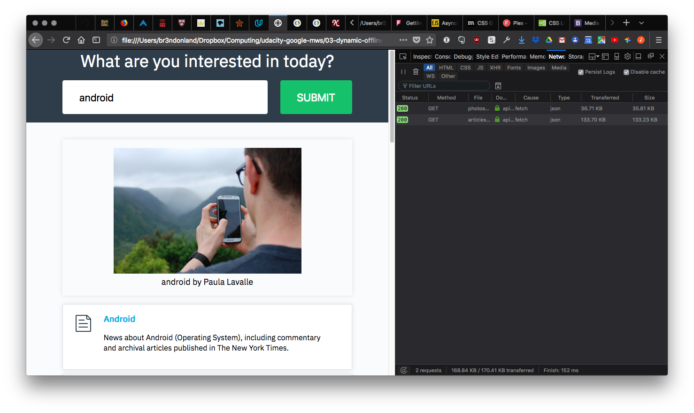

# Ajax with Fetch

<a href="https://www.udacity.com/">
  
</a>

[Asynchronous JavaScript Requests course](https://www.udacity.com/course/es6-javascript-improved--ud356) lesson 3/3

Udacity Google Mobile Web Specialist Nanodegree program part 3 lesson 03

Brendon Smith

[br3ndonland](https://github.com/br3ndonland)

## Table of Contents

- [Table of Contents](#table-of-contents)
- [Intro to Fetch](#intro-to-fetch)
  - [3.01. Ajax call with the Fetch API](#301-ajax-call-with-the-fetch-api)
  - [3.02. What is Fetch](#302-what-is-fetch)
- [Fetch syntax](#fetch-syntax)
  - [3.03. Write the Fetch Request](#303-write-the-fetch-request)
  - [3.04. Handle The Response](#304-handle-the-response)
  - [3.05. The Response Object](#305-the-response-object)
- [Refining fetch requests](#refining-fetch-requests)
  - [3.06. ES6 Arrow Function](#306-es6-arrow-function)
  - [3.07. Display Content & Handling Errors](#307-display-content--handling-errors)
- [Fetch app](#fetch-app)
  - [3.08. Project Wrap-up](#308-project-wrap-up)
  - [3.09. Fetch Outro](#309-fetch-outro)
  - [3.10. Course Outro](#310-course-outro)
  - [Completed Fetch app](#completed-fetch-app)
  - [Fetch app refactored with async await](#fetch-app-refactored-with-async-await)

## Intro to Fetch

### 3.01. Ajax call with the Fetch API

Fetch is a helpful tool for making network requests. The instructor Richard Kalehoff uses the analogy of baking a cake. The XMLHttpRequest API is like baking a cake yourself. The jQuery Ajax API is like having a professional bake the cake. Fetch combines the best qualities of both.

### 3.02. What is Fetch

> Fetch is the new way to make network requests! After looking at all of the manual setup that needs to go into setting up an `XMLHttpRequest`, you might be feeling (like I sure did!) that a lot of complexity went into making a simple request. If all I want is an image from Unsplash, why do I need to do all this setup before I can even make the request? I just want an image file, so let me just ask for the file without having to drill through the unnecessarily complicated XHR spec.
>
> Fetch is a new API that was built to make requesting resources (primarily across a network) a whole lot easier. One thing that makes the new Fetch API a lot nicer than the old XHR way of doing things is that Fetch is promise-based!
>
> Hopefully you're sold that Fetch is the way of the future for making requests, so let's see it in action!

#### ⚠️ Fetch Is Promise-based ⚠️

> As mentioned above, the new Fetch API utilizes Promises under the hood. If you've got a handle on how Promises work, then give yourself a pat on the back then skip down to the next section. If the word "Promises" makes you feel a little queasy and unsure of your life's future, don't panic! Breathe! Then head over to our short course on JavaScript Promises to level up your JavaScript muscles.

#### ⚠️ Might Need A Polyfill ⚠️

> Check out [caniuse](https://caniuse.com/#feat=fetch) to see if your browser supports this awesome new API!
>
> If your browser is not supported, just add [this polyfill](https://github.com/github/fetch) to your project, so you can start using Fetch even without your browser supporting it!

## Fetch syntax

### 3.03. Write the Fetch Request

#### Write The Fetch Request

> Ok, let's look at a sample fetch request, and then we'll make a fetch request for an image from Unsplash.
>
> ```js
> fetch('URL-to-the-resource-that-is-being-requested');
> ```
>
> So yeah...that's it. In it's smallest form, a Fetch request is just the `fetch()` function and a string to the resource that's being requested. It's just so short and easy to read (*sigh* I think I'm in love!). Let's take a peek at what a real request looks like:
>
> ```js
> fetch('https://api.unsplash.com/search/photos?page=1&query=flowers');
> ```
>
> If you try running this Fetch request on the console, then you should get a Promise returned to you.
>
> 
>
> A fetch request being run on the console of Unsplash's website. The fetch request returns a Promise.

#### 💡 Cross-Origin Issues 💡

> Did you just try running the Fetch request and it didn't work? Were you running it on Unsplash's website? If not, make sure you go to [https://unsplash.com/](https://unsplash.com/), open the console, and try running it from there.
>
> Just because Fetch is new and awesome and is replacing the XHR object for making asynchronous network requests *doesn't* mean it can bypass the rules for making those network requests. **Fetch requests still need to obey the cross-origin protocol** of how resources are shared. This means that, by default, you can only make requests for assets and data on the same domain as the site that will end up loading the data.
>
> Remember that Unsplash requires an Authorization header to make a request through its API. Check out these links on Fetch's documentation to see how to add an `Authorization` header to the Fetch request.
>
> - [MDN: Fetch](https://developer.mozilla.org/en-US/docs/Web/API/GlobalFetch/fetch)
> - [MDN: Using Fetch](https://developer.mozilla.org/en-US/docs/Web/API/Fetch_API/Using_Fetch)
> - [MDN: Fetch API](https://developer.mozilla.org/en-US/docs/Web/API/Fetch_API)

#### Question 1 of 2

> Docs are a dev's best friend! Take a quick look through them and pick the correct way(s) to add a header to a Fetch request from the options below. Also, instead of cheating and guessing, try testing out the code you think is correct in your app or on the console to see how it runs!
>
> 1
>
> ```js
> fetch.setRequestHeader('Authorization', 'Client-ID paste_access_key_here');
> fetch(`https://api.unsplash.com/search/photos?page=1&query=${searchedForText}`);
> ```
>
> 2
>
> ```js
> fetch(`https://api.unsplash.com/search/photos?page=1&query=${searchedForText}`, {
>   headers: {
>     Authorization: 'Client-ID paste_access_key_here'
>   }
> });
> ```
>
> 3
>
> ```js
> const requestHeaders = new Headers();
> requestHeaders.append('Authorization', 'Client-ID paste_access_key_here');
> fetch(`https://api.unsplash.com/search/photos?page=1&query=${searchedForText}`, {
>   headers: requestHeaders
> });
> ```
>
> 4
>
> ```js
> fetch(`https://api.unsplash.com/search/photos?page=1&query=${searchedForText}`)
> .then(function(request){
>   request.addHeader('Authorization', 'Client-ID paste_access_key_here');
> });
> ```
>

<details><summary>Solution</summary>

> Thanks for completing that!
>
> The correct answers are options 2 and 3.
>
> 2
>
> ```js
> fetch(`https://api.unsplash.com/search/photos?page=1&query=${searchedForText}`, {
>   headers: {
>     Authorization: 'Client-ID paste_access_key_here'
>   }
> });
> ```
>
> 3
>
> ```js
> const requestHeaders = new Headers();
> requestHeaders.append('Authorization', 'Client-ID paste_access_key_here');
> fetch(`https://api.unsplash.com/search/photos?page=1&query=${searchedForText}`, {
>   headers: requestHeaders
> });
> ```
>
> The Fetch request takes the URL to the requested resource as the first argument, but the second argument is a configuration object. One of the options to this config object is a headers property.
>
> One of the new additions that rode along on the coattails of Fetch is a new Headers [constructor function](https://developer.mozilla.org/en-US/docs/Web/API/Headers). The headers property of a Fetch request's configuration object can either be a plain object of headers to include, or it can be a Headers object that's been built up with headers.

</details>

**Note that the `Client-ID` required by the Unsplash API is the Access Key, not the Secret Key. The "app" is in the [GitHub repo](https://github.com/udacity/course-ajax) provided in the [first lesson](ajax-1-xhr.md). The GitHub repo does not include a completed version of the code.**

#### Question 2 of 2

> What do you think the default HTTP method is for a Fetch request? Why don't you try running a Fetch request and look in the DevTools to see the HTTP method that is used.
>
> Check out these links from the specification to find out more: [Fetch methods](https://fetch.spec.whatwg.org/#methods), [Fetch requests](https://fetch.spec.whatwg.org/#requests).
>
> - FETCH
> - fetch
> - POST
> - post
> - GET
> - get
> - REQUEST
> - request

<details><summary>Solution</summary>

GET

</details>

#### Changing The HTTP Method

> So the default HTTP method for a Fetch request is the `GET` method. We can choose a different HTTP method by passing a `method` property in the configuration object:
>
> ```js
> fetch(`https://api.unsplash.com/search/photos?page=1&query=${searchedForText}`, {
>   method: 'POST'
> });
> ```
>
> This will send the request with the `POST` HTTP header.
>
> Fetch's specification does not limit what HTTP methods can be used, although it does recommend that all methods are written in uppercase for consistency with the HTTP Verbs specification.

### 3.04. Handle The Response

#### Handle The Response

> Ok, you've learned about making a Fetch request, and you've sent a few of them off...but nothing happened because we didn't tell our code to handle the response. Let's get our code ready to handle the response.
>
> Remember that Fetch is Promise-based. This means that when we fire of the Fetch request, it will automatically return a promise that we can use to listen for the response.
>
> 💡 Javascript Promises Reminder 💡
>
> Dealing with the returned data from a Fetch request is all done with Promises, so if any of this looks confusing or you don't know how `.then()` works or why it's needed, check out our [course on JavaScript Promises](https://www.udacity.com/course/javascript-promises--ud898).
>
> Since a Fetch request returns a Promise, then all you have to do is call `.then()` on that Promise.
>
> ```js
> fetch(`https://api.unsplash.com/search/photos?page=1&query=${searchedForText}`, {
>   headers: {
>     Authorization: 'Client-ID paste_access_key_here'
>   }
> }).then(function(response) {
>   debugger; // work with the returned response
> });
>
> ```
>
> If you haven't already, put the code above in our JavaScript file and search for something. Because we added a `debugger` line inside the `.then()` function, the code will pause on the `debugger` line when the response is finally returned.
>
> 
>
> Browser showing the app with DevTools loaded. A search for "trees" is made. The browsers pauses at the debugger line. The response is a Response object.

#### Quiz Question

> We've successfully made the request, and you should be able to see the response in your console. Which property has the actual JSON data of the images?
>
> - `.data`
> - `.images`
> - `.response`
> - both `.images` and `.data`
> - none of the above

<details><summary>Solution</summary>

None of the above

</details>

### 3.05. The Response Object

#### The Response Object

> See how the response that's returned is of the `Response` type? This `Response` object is new with the Fetch API and is what's returned when a Fetch request resolves.
>
> Ok, so that's great and all, but did you notice anything weird about the response object? It didn't have any of the data that we searched for! That's because a response object has information about the response itself, it doesn't have the data...yet. To actually get the data, we need to get the "body" of the response.
>
> Since the Unsplash API we're using will return JSON to us, we just need to call `.json()` on the response variable.
>
> ```js
> fetch(`https://api.unsplash.com/search/photos?page=1&query=${searchedForText}`, {
>   headers: {
>     Authorization: 'Client-ID paste_access_key_here'
>   }
> }).then(function(response) {
>   return response.json();
> });
> ```
>
> The `.json()` method on a Response object returns a Promise, so we need to chain on *another* `.then()` to actually get and start using the returned data. This time, let's call `addImage` to pass it the returned data:
>
> ```js
> fetch(`https://api.unsplash.com/search/photos?page=1&query=${searchedForText}`, {
>     headers: {
>         Authorization: 'Client-ID paste_access_key_here'
>     }
> }).then(function(response) {
>     return response.json();
> }).then(addImage);
>
> function addImage(data) {
>     debugger;
> }
> ```
>
> There are a number of methods on a Response object. Each one will let the code handle different response types.
>
> For example, the `.json()` method that we've looked at will take the response and convert it to JSON. What happens if we requested an image, instead?

#### Response Quiz Question

> Which of the following methods should be used if you wanted to fetch an image? If you get stuck, check out [MDN: Making fetch requests](https://developer.mozilla.org/en-US/docs/Web/API/Fetch_API/Using_Fetch#Making_fetch_requests) and [https://davidwalsh.name/fetch](https://davidwalsh.name/fetch).
>
> - `.arrayBuffer()`
> - `.blob()`
> - `.formData()`
> - `.json()`
> - `.text()`

<details><summary>Solution</summary>

`.blob()`

</details>

## Refining fetch requests

### 3.06. ES6 Arrow Function

***The ES6 lessons should be presented before the Ajax lessons.***

> You might be thinking that this Fetch request is starting to look like a lot of code...and it is. One quick way to shrink the amount of code is to use an ES6 Arrow function! We can convert the first `.then()` function that gets the response, calls the `.json()` method on it, and returns a Promise all to a single line with an Arrow function:
>
> ```js
> // without the arrow function
> .then(function(response) {
>   return response.json();
> })
>
> // using the arrow function
> .then(response => response.json())
> ```
>
> So the new request would be:
>
> ```js
> fetch(`https://api.unsplash.com/search/photos?page=1&query=${searchedForText}`, {
>   headers: {
>     Authorization: 'Client-ID paste_access_key_here'
>   }
> }).then(response => response.json())
> .then(addImage);
>
> function addImage(data) {
>   debugger;
> }
>
> ```
>
> If Arrow functions are new to you, check out our [ES6 course](https://classroom.udacity.com/courses/ud356)!
>
> 
>
> Browser showing the app with DevTools loaded. A search for "trees" is made. The browsers pauses at the debugger line. The actual JSON response appears on the console.

### 3.07. Display Content & Handling Errors

#### Display The Image On The Page

> We're making our request to Unsplash, it's returning a response that we're then converting to JSON, and now we're seeing the actual JSON data. Fantastic! All we need to do now is display the image and caption on the page.
>
> Here's the code that I'm using:
>
> ```js
> function addImage(data) {
>   let htmlContent = '';
>   const firstImage = data.results[0];
>   if (firstImage) {
>     htmlContent = `<figure>
>       
>       <figcaption>${searchedForText} by ${firstImage.user.name}</figcaption>
>       </figure>`;
>   } else {
>     htmlContent = 'Unfortunately, no image was returned for your search.'
>   }
>   responseContainer.insertAdjacentHTML('afterbegin', htmlContent);
> }
> ```
>
> This code will:
>
> - get the first image that's returned from Unsplash
> - create a `<figure>` tag with the small image
> - creates a `<figcaption>` that displays the text that was searched for along with the first name of the person that took the image
> - if no images were returned, it displays an error message to the user

#### Handling Errors

> Our app is now done with getting the image from Unsplash!...almost. We're requesting the image and adding it to the page, but this is only *one* possible outcome. Granted, it's the most likely way that the app will end up, but we're not handling any errors. What errors could possible happen you ask? A couple I can think of are:
>
> - Issues with the network
> - Issues with the fetch request
> - Unsplash not having an image for the searched term
>
> We're handling this last one in the `addImage` function. For the other two, we can use chain on a `.catch()` method to the Fetch request!
>
> Again, because a Fetch request returns a Promise `.catch()` is available to us from the Promise API.
>
> So let's add a `.catch()` method to handle errors:
>
> ```js
> fetch(`https://api.unsplash.com/search/photos?page=1&query=${searchedForText}`, {
>   headers: {
>     Authorization: 'Client-ID paste_access_key_here'
>   }
> }).then(response => response.json())
> .then(addImage)
> .catch(e => requestError(e, 'image'));
>
> function addImage(data) {
>   debugger;
> }
>
> function requestError(e, part) {
>   console.log(e);
>   responseContainer.insertAdjacentHTML('beforeend', `<p class="network-warning">Oh no! There was an error making a request for the ${part}.</p>`);
> }
>
> ```
>
> This code adds the `requestError` function and adds a `.catch()` request to the end of the Promise chain. The `.catch()` function will receive an error object (that we're storing in the `e` variable) and in turn calls `requestError` passing along the error object and the request that failed. If the Promise rejects anywhere along the line, the `requestError` function will log the error and display a warning message to the user that the request failed for some reason.

## Fetch app

### 3.08. Project Wrap-up

#### Add NY Times Code

> The app is now able to handle searching for images and displaying images! Woohoo!
>
> Now see if you can follow these same steps to get the New York Times articles to display. When you can perform a search in your app and have both an image and some New York Times articles display, check the checkbox below.
>
> This might seem like a lot, but we looked in detail at how to make a Fetch request and how to handle the response. You're basically going to follow the exact same steps for this request. You'll need to: make the request to the NYTimes API convert the response to JSON, loop through the JSON data, and add the articles to the page.
>
> Bonus points if you use `.catch()` to handle any network errors!

#### Troubleshooting Fetch code

***The completed code was shown in the video, but not included in the GitHub repo.***

When I first wrote out the code, I coded the `addImage` and `addArticles` functions as arrow functions.

<details><summary>Completed Fetch code with arrow functions</summary>

JavaScript Standard Style

```js
(function () {
  const form = document.querySelector('#search-form')
  const searchField = document.querySelector('#search-keyword')
  let searchedForText
  const responseContainer = document.querySelector('#response-container')
  // Listen for, and act on, form submissions
  form.addEventListener('submit', function (e) {
    e.preventDefault()
    responseContainer.innerHTML = ''
    searchedForText = searchField.value
    // Query Unsplash API
    fetch(`https://api.unsplash.com/search/photos?page=1&query=${searchedForText}`, {
      headers: {
        Authorization: 'Client-ID paste_access_key_here'
      }
    }).then(r => r.json())
      .then(addImage)
      .catch(e => requestError(e, 'image'))
    // Query NYT article search API
    fetch(`https://api.nytimes.com/svc/search/v2/articlesearch.json?q=${searchedForText}`, {
      headers: {
        Authorization: 'api-key paste_api_key'
      }
    }).then(r => r.json())
      .then(addArticles)
      .catch(e => requestError(e, 'article'))
    const addImage = data => {
      let htmlContent = ''
      const firstImage = data.results[0]
      if (firstImage) {
        htmlContent = `<figure>
        
        <figcaption>${searchedForText} by ${firstImage.user.name}</figcaption>
        </figure>`
      } else {
        htmlContent = 'Unfortunately, no image was returned for your search.'
      }
      responseContainer.insertAdjacentHTML('afterbegin', htmlContent)
    }
    const addArticles = data => {
      let htmlContent = ''
      if (data.response && data.response.docs && data.response.docs.length > 1) {
        const articles = data.response.docs
        htmlContent = '<ul>' + articles.map(article => `<li class="article">
          <h2><a href ="${article.web_url}">${article.headline.main}</a></h2>
          <p>${article.snippet}</p></li>`)
          .join('') + '</ul>'
      } else {
        htmlContent = '<div class="error-no-articles">No articles available</div>'
      }
      responseContainer.insertAdjacentHTML('beforeend', htmlContent)
    }
    const requestError = (e, part) => {
      console.log(e)
      responseContainer.insertAdjacentHTML('beforeend',
        `<p class="network-warning">Oh no! There was an error making a request for the ${part}.</p>`)
    }
  })
})()

```

</details>

This code was throwing an error in the browser console after opening the HTML and searching:

```text
ReferenceError: can't access lexical declaration `addImage' before initialization
```

I had already taken the ES6 lessons, so I knew that regular functions can be either function declarations or function expressions, but arrow functions are *always* expressions. I thought this could have been the source of the error, so I rewrote the `addImage` and `addArticles` functions as function declarations.

<details><summary>Completed Fetch code with function declarations</summary>

JavaScript Standard Style

```js
(function () {
  const form = document.querySelector('#search-form')
  const searchField = document.querySelector('#search-keyword')
  let searchedForText
  const responseContainer = document.querySelector('#response-container')
  // Listen for, and act on, form submissions
  form.addEventListener('submit', function (e) {
    e.preventDefault()
    responseContainer.innerHTML = ''
    searchedForText = searchField.value
    // Query Unsplash API
    fetch(`https://api.unsplash.com/search/photos?page=1&query=${searchedForText}`, {
      headers: {
        Authorization: 'Client-ID paste_access_key_here'
      }
    }).then(r => r.json())
      .then(addImage)
      .catch(e => requestError(e, 'image'))
    // Query NYT article search API
    fetch(`https://api.nytimes.com/svc/search/v2/articlesearch.json?q=${searchedForText}`, {
      headers: {
        Authorization: 'api-key paste_api_key'
      }
    }).then(r => r.json())
      .then(addArticles)
      .catch(e => requestError(e, 'article'))
    function addImage (data) {
      let htmlContent = ''
      const firstImage = data.results[0]
      if (firstImage) {
        htmlContent = `<figure>
        
        <figcaption>${searchedForText} by ${firstImage.user.name}</figcaption>
        </figure>`
      } else {
        htmlContent = 'Unfortunately, no image was returned for your search.'
      }
      responseContainer.insertAdjacentHTML('afterbegin', htmlContent)
    }
    function addArticles (data) {
      let htmlContent = ''
      if (data.response && data.response.docs && data.response.docs.length > 1) {
        const articles = data.response.docs
        htmlContent = '<ul>' + articles.map(article => `<li class="article">
          <h2><a href ="${article.web_url}">${article.headline.main}</a></h2>
          <p>${article.snippet}</p></li>`)
          .join('') + '</ul>'
      } else {
        htmlContent = '<div class="error-no-articles">No articles available</div>'
      }
      responseContainer.insertAdjacentHTML('beforeend', htmlContent)
    }
    function requestError (e, part) {
      console.log(e)
      responseContainer.insertAdjacentHTML('beforeend',
        `<p class="network-warning">Oh no! There was an error making a request for the ${part}.</p>`)
    }
  })
})()

```

</details>

This eliminated the lexical declaration error, but I then got a CORS error from NYT:

```text
Cross-Origin Request Blocked: The Same Origin Policy disallows reading the remote
 resource at https://api.nytimes.com/svc/search/v2/articlesearch.json?q=Android.
 (Reason: CORS header ‘Access-Control-Allow-Origin’ missing).
```

I added `mode: 'no-cors'` to the NYT fetch request.

Next, I got a JSON parsing error:

```text
SyntaxError: JSON.parse: unexpected end of data at line 1 column 1 of the JSON data
```

This is probably due to the opaque response returned from `mode: 'no-cors'`.

I checked out the network requests on the network tab of the browser developer tools. I saw that the NYT request came back as `401 unauthorized`, meaning it was not reading my API key. I tried adding the API key directly to the URL in the fetch request, and it worked.

```js
fetch(`https://api.nytimes.com/svc/search/v2/articlesearch.json?q=${searchedForText}&api-key=paste_api_key`)
```

The [NYT Article Search API](https://developer.nytimes.com/article_search_v2.json) docs only include examples for jQuery and Request, so maybe they're not recognizing the new Fetch header construction.

Searching now returns an image from Unsplash, and article results from NYT.



**Success!**

### 3.09. Fetch Outro

### 3.10. Course Outro

### Completed Fetch app

The completed app can be found in the [app-fetch](app-fetch) directory. I have included the code here as well.

<details><summary>HTML in ajax-3-fetch-app.html</summary>

```html
<!DOCTYPE html>
<html>
<head>
  <meta charset="UTF-8">
  <meta name="viewport" content="width=device-width, initial-scale=1.0">
  <meta http-equiv="X-UA-Compatible" content="ie=edge">
  <title>Ajax with Fetch</title>
  <link href="https://fonts.googleapis.com/css?family=IBM+Plex+Sans" rel="stylesheet">
  <link href="static/css/styles.css" rel="stylesheet">
</head>
<body>
  <header class="masthead">
    <h1>What are you interested in today?</h1>
    <div class="site-container">
      <form id="search-form" action="#">
        <label for="search-keyword" class="visuallyhidden">What are you interested in today?</label>
        <input id="search-keyword" type="text" name="search-keyword" placeholder="e.g. Android" required>
        <input id="submit-btn" type="submit" value="Submit">
      </form>
    </div>
  </header>
  <div class="site-container">
    <div id="response-container"></div>
  </div>
  <script src="static/js/ajax-3-fetch-app.js"></script>
</body>
</html>

```

</details>
<details><summary>CSS in styles.css</summary>

```css
html {
  box-sizing: border-box;
}

*,
*::before,
*::after {
  box-sizing: inherit;
}

body {
  background: #fafbfc;
  font-family: 'IBM Plex Sans', sans-serif;
  margin: 0;
  padding: 0;
}

.site-container {
  margin: auto;
  max-width: 1200px;
  width: 80%;
}

.masthead {
  background: #2e3d49;
  /* padding: 2rem 0; */
}

.masthead h1 {
  color: #ffffff;
  font-weight: normal;
  margin: 0;
  /* margin-bottom: 0.2rem; */
  text-align: center;
}

/*** Search Form ***/
#search-form {
  display: flex;
  padding: 1rem 0;
  font-size: 2rem;
}

#search-keyword {
  border: none;
  border-radius: 4px;
  flex-grow: 1;
  margin-right: 1.5rem;
  padding: 1.25rem 2rem;
  font-size: 1.25rem;
}

#submit-btn {
  background-color: #15c26b;
  border: none;
  border-radius: 4px;
  color: #ffffff;
  cursor: pointer;
  padding: 1rem 2rem;
  text-transform: uppercase;
  font-size: 1.25rem;
}

#submit-btn:hover {
  background-color: #12a159;
}

/*** Response Container ***/
#response-container {
  margin-top: 2rem;
}

/*** Image Styling ***/
figure {
  display: block;
  margin: auto;
  text-align: center;
  box-shadow: 0 0 10px 0 rgba(0, 0, 0, 0.1);
  padding: 1rem;
}
/* figure {
  margin: 0;
  margin-bottom: 2rem;
  position: relative;
  text-align: center;
}

figure img {
  box-shadow: 0 0 10px 0 rgba(0, 0, 0, 0.1);
  max-width: 100%;
  width: 50%;
}

figcaption {
  bottom: 5px;
  background: rgba(0, 0, 0, 0.5);
  color: #ffffff;
  font-size: 14px;
  padding: 0.8rem 1.4rem;
  position: absolute;
  width: 50%;
} */

/*** Article Styling ***/
ul {
  list-style: none;
  padding: 0;
}

.article {
  background: url('../img/icon-article.png'), #ffffff;
  background-position: 1.5rem 1.2rem;
  background-repeat: no-repeat;
  background-size: 1.8rem;
  border: solid 1px #dbe2e8;
  box-shadow: 0 0 10px 0 rgba(0, 0, 0, 0.1);
  margin-bottom: 0.5rem;
  padding: 1rem 2rem 1rem 4.8rem;
}

.article:hover {
  box-shadow: 0 0 20px 0 rgba(0, 0, 0, 0.2);
}

.article h2 {
  font-size: 18px;
  font-weight: 600;
  margin: 0;
}

.article h2 a {
  color: #02b3e4;
  text-decoration: none;
}

.article h2 a:hover {
  text-decoration: underline;
}

.article p {
  font-size: 0.9rem;
  line-height: 1.4;
}


/*** Error State Styling ***/
.error-no-image {
  background: url(../img/icon-no-image.png) no-repeat 50% top;
  margin-bottom: 3rem;
  padding-top: 8rem;
  text-align: center;
}

.error-no-articles {
  background: url('../img/icon-no-articles.png') no-repeat 50% top;
  margin-top: 3rem;
  padding-top: 8rem;
  text-align: center;
}

/*** Helpers ***/
.visuallyhidden {
  border: 0;
  clip: rect(0 0 0 0);
  height: 1px;
  margin: -1px;
  overflow: hidden;
  padding: 0;
  position: absolute;
  width: 1px;
  white-space: nowrap; /* 1 */
}

```

</details>

<details><summary>JavaScript in ajax-3-fetch-app.js</summary>

JavaScript Standard Style

```js
(function () {
  const form = document.querySelector('#search-form')
  const searchField = document.querySelector('#search-keyword')
  let searchedForText
  const responseContainer = document.querySelector('#response-container')
  // Listen for, and act on, form submissions
  form.addEventListener('submit', function (e) {
    e.preventDefault()
    responseContainer.innerHTML = ''
    searchedForText = searchField.value
    // Query Unsplash API
    fetch(`https://api.unsplash.com/search/photos?page=1&query=${searchedForText}`, {
      method: 'GET',
      headers: {
        Authorization: 'Client-ID paste_access_key_here'
      }
    }).then(r => r.json())
      .then(addImage)
      .catch(e => requestError(e, 'image'))
    // Query NYT article search API
    fetch(`https://api.nytimes.com/svc/search/v2/articlesearch.json?q=${searchedForText}&api-key=paste_api_key`)
      .then(r => r.json())
      .then(addArticles)
      .catch(e => requestError(e, 'article'))
    function addImage (data) {
      let htmlContent = ''
      if (data && data.results && data.results.length > 1) {
        const firstImage = data.results[0]
        htmlContent = `<figure>
        
        <figcaption>${searchedForText} by ${firstImage.user.name}</figcaption>
        </figure>`
      } else {
        htmlContent = 'Unfortunately, no image was returned for your search.'
      }
      responseContainer.insertAdjacentHTML('afterbegin', htmlContent)
    }
    function addArticles (data) {
      let htmlContent = ''
      if (data.response && data.response.docs && data.response.docs.length > 1) {
        const articles = data.response.docs
        htmlContent = '<ul>' + articles.map(article => `<li class="article">
          <h2><a href ="${article.web_url}">${article.headline.main}</a></h2>
          <p>${article.snippet}</p></li>`)
          .join('') + '</ul>'
      } else {
        htmlContent = '<div class="error-no-articles">No articles available</div>'
      }
      responseContainer.insertAdjacentHTML('beforeend', htmlContent)
    }
    function requestError (e, part) {
      console.log(e)
      responseContainer.insertAdjacentHTML('beforeend',
        `<p class="network-warning">Oh no! There was an error making a request for the ${part}.</p>`)
    }
  })
})()

```

</details>

### Fetch app refactored with async await

After learning about async/await, I refactored the Unsplash and NYT API queries in a standalone Node.js file. I tried to include the changes in the app as well, but wasn't able to get it to work.

<details><summary>JavaScript refactored with async/await in ajax-3-fetch-app-node.js</summary>

```js
// Require modules to run file from Node.js outside of browser
const fetch = require('node-fetch')

const fetchUnsplashNYT = async (query) => {
  // Fetch data from Unsplash API
  try {
    const fetchResult = fetch(`https://api.unsplash.com/search/photos?page=1&query=${query}`, {
      method: 'GET',
      headers: {
        Authorization: 'Client-ID paste_access_key_here'
      }
    })
    const json = await (await fetchResult).json()
    console.group('Unsplash')
    console.log(`Results returned: ${json.results.length}\nInfo for first three images:`)
    const imageData = json.results.slice(0, 3).map(image => {
      console.log(`Image info:`,
        `\nID: ${image.id}`,
        `\nDescription: ${image.description}`,
        `\nUser: ${image.user.username}`,
        `\nURL: ${image.urls.regular}`
      )
    })
    console.groupEnd('Unsplash')
  } catch (e) {
    throw Error(e)
  }
  // Fetch data from NYT API
  try {
    const fetchResult = fetch(`https://api.nytimes.com/svc/search/v2/articlesearch.json?q=${query}&api-key=paste_api_key`)
    const json = await (await fetchResult).json()
    console.group('The New York Times')
    const articles = json.response.docs.map(article => {
      console.log(`${article.web_url}\n${article.headline.main}\n${article.snippet}`)
    })
    console.groupEnd('The New York Times')
  } catch (e) {
    throw Error(e)
  }
}
fetchUnsplashNYT('android')

```

</details>

[Previous lesson](ajax-2-jquery.md)

[Back to TOC](#table-of-contents)